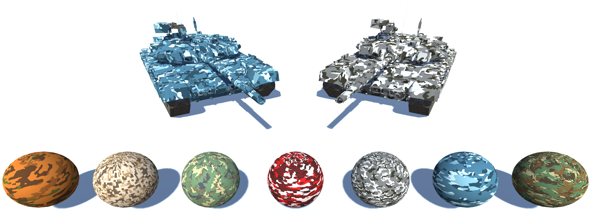

# ProceduralCamouflage

Pseudo-procedural system for automatic camouflage generation using Unity Shader Graph. The user provides up to 4 colors and a 2D texture with pattern. From there, the system takes care of generating the texture for the objects. The user can also control texture offsets and scales.

[]